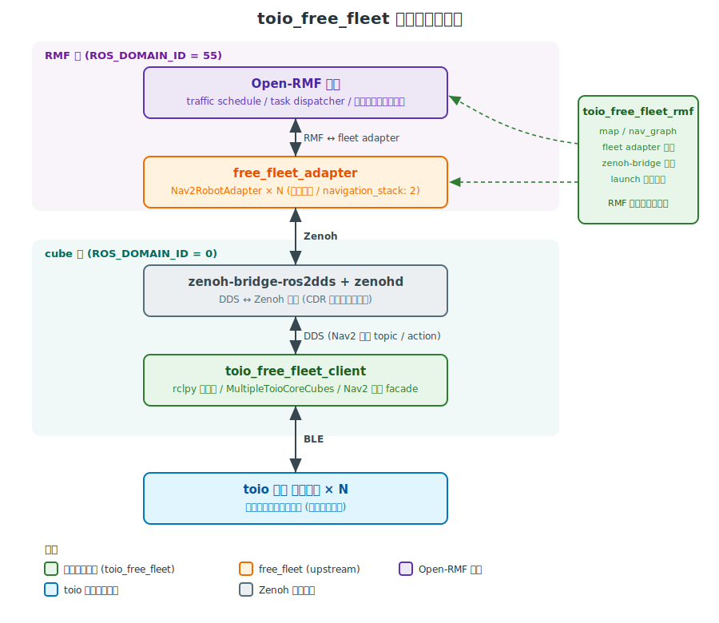

# toio_free_fleet

[Open-RMF](https://github.com/open-rmf/rmf) の [`free_fleet`](https://github.com/open-rmf/free_fleet) を使って、
ソニーの [toio コア キューブ](https://toio.io/) を Open-RMF に接続するためのリポジトリです。

## アーキテクチャ



## 動作環境

- Ubuntu 24.04
- ROS 2 Jazzy + `rmw-cyclonedds-cpp`
- Python 3.10 以上

## 前提

以下が `~/ff_ws` にセットアップ済みであることが前提です。手順は各リポジトリを参照してください。

- ROS 2 Jazzy ([docs.ros.org](https://docs.ros.org/en/jazzy/Installation.html))
- Open-RMF (apt の `ros-jazzy-rmf-dev` でも、ソースビルドでも構いません)
- `free_fleet` のビルド + `zenohd` / `zenoh-bridge-ros2dds` のインストール
  ([open-rmf/free_fleet README](https://github.com/open-rmf/free_fleet))

## Setup

### 1. 本リポジトリのクローンとビルド

BLE を使うための依存をインストールします。

```bash
pip3 install 'toio-py>=1.0' --break-system-packages
sudo apt install -y bluez ros-jazzy-nav2-msgs
```

本リポジトリをクローンしてビルドします。

```bash
cd ~/ff_ws/src
git clone https://github.com/remix-yh/toio_free_fleet.git

cd ~/ff_ws
rosdep install --from-paths src --ignore-src --rosdistro $ROS_DISTRO -yr
colcon build --packages-select toio_free_fleet_client toio_free_fleet_rmf \
  --cmake-args -DCMAKE_BUILD_TYPE=Release
source ~/ff_ws/install/setup.bash
```

### 2. cube ID の確認と `client.yaml` への登録

物理 cube と論理名 (`cube_0`, `cube_1`, ...) のマッピングを固定しないと、
起動するたびにロボットの役割が入れ替わってしまいます。BLE local name の末尾 3 文字
(例: `H7p`) を **cube ID** として `client.yaml` に書きます。

cube 底面シールには ID が直接印字されていない世代もあるので、**BLE スキャンで確認します**。

```bash
bluetoothctl scan on
# ... [NEW] Device XX:XX:XX:XX:XX:XX toio Core Cube-H7p
#     local name 末尾 3 文字 (H7p) が cube ID
bluetoothctl scan off
```

`toio_free_fleet_client/config/client.yaml` の `robots:` を書き換えます。

```yaml
fleet:
  name: toio
  robots:
    - name: cube_0
      cube_id: H7p              # ← cube 底面シール末尾 3 文字
      led_color: [0xFF, 0x00, 0x00]
    - name: cube_1
      cube_id: j3F
      led_color: [0x00, 0x00, 0xFF]
```

`led_color` は省略できます。指定 ID の cube が見つからなければ `RuntimeError` で停止します。

### 3. マップ作成

`traffic_editor` でマップ (waypoint / lane) を編集します。

```bash
traffic_editor maps/toio_map/toio_map.building.yaml
```

編集後に `colcon build` すると、nav graph (`nav_graphs/0.yaml`) が
`toio_map.building.yaml` から自動生成されます (`CMakeLists.txt` の
`add_custom_command` が `building_map_generator nav` を呼びます)。

```bash
cd ~/ff_ws
colcon build --packages-select toio_free_fleet_rmf
# install/toio_free_fleet_rmf/share/toio_free_fleet_rmf/maps/toio_map/nav_graphs/0.yaml
# が更新される
```

## 起動

ターミナル 2 つで完了します。cube 側と RMF 側で `ROS_DOMAIN_ID` を分けるのは
free_fleet の nav2 例と同じパターンです。

### Terminal 1: cube 側 (zenohd + bridge + client)

```bash
source ~/ff_ws/install/setup.bash
export RMW_IMPLEMENTATION=rmw_cyclonedds_cpp

ros2 launch toio_free_fleet_rmf cube_side.launch.xml
```

各 cube の LED 色がコンフィグ通りに点灯すれば接続成功です。
zenoh-bridge-ros2dds のバイナリ位置を変えたい場合は
`zenoh_bridge_bin:=<path>` を渡します。

### Terminal 2: RMF 側

```bash
source ~/ff_ws/install/setup.bash
export RMW_IMPLEMENTATION=rmw_cyclonedds_cpp
export ROS_DOMAIN_ID=55

ros2 launch toio_free_fleet_rmf fleet_adapter.launch.xml
```

### タスク投入 (同じくドメイン 55)

```bash
source ~/ff_ws/install/setup.bash
export ROS_DOMAIN_ID=55

ros2 run rmf_demos_tasks dispatch_patrol \
  -p st_1 st_2 -n 3
```

`st_1` 等は `toio_map.building.yaml` で打った頂点名と合わせます。

## ライセンス

Apache-2.0
